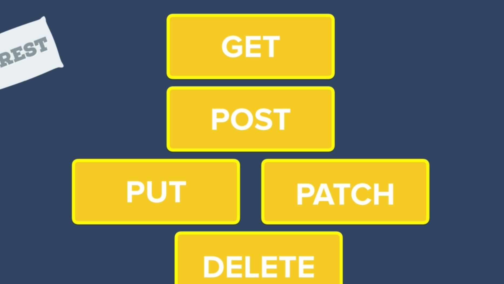

# RESTful-API_INDIA-into-Finals-Yayyy

## Example Documents
```
{
    "_id" : ObjectId("5c139771d79ac8eac11e754a"),
    "title" : "API",
    "content" : "API stands for Application Programming Interface. It is a set of subroutine definitions, communication protocols, and tools for building software. In general terms, it is a set of clearly defined methods of communication among various components. A good API makes it easier to develop a computer program by providing all the building blocks, which are then put together by the programmer."
}


{
    "_id" : ObjectId("5c1398aad79ac8eac11e7561"),
    "title" : "Bootstrap",
    "content" : "This is a framework developed by Twitter that contains pre-made front-end templates for web design"
}


{
    "_id" : ObjectId("5c1398ecd79ac8eac11e7567"),
    "title" : "DOM",
    "content" : "The Document Object Model is like an API for interacting with our HTML"
}
```

## Server Starting Code

```
//jshint esversion:6

const express = require("express");
const bodyParser = require("body-parser");
const ejs = require("ejs");
const mongoose = require('mongoose');

const app = express();

app.set('view engine', 'ejs');

app.use(bodyParser.urlencoded({
  extended: true
}));
app.use(express.static("public"));

//TODO

app.listen(3000, function() {
  console.log("Server started on port 3000");
});
```

## Syntax of REST requests




 

 

 

 

 

 


